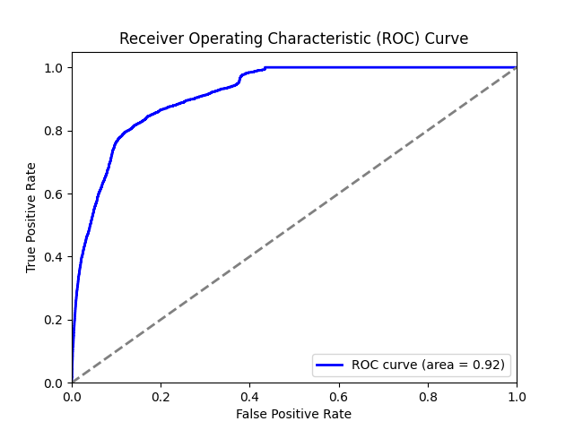
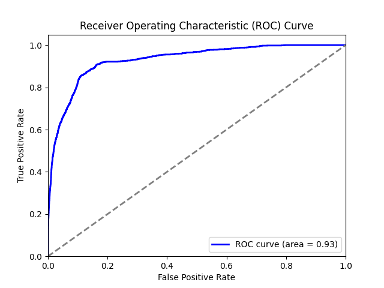
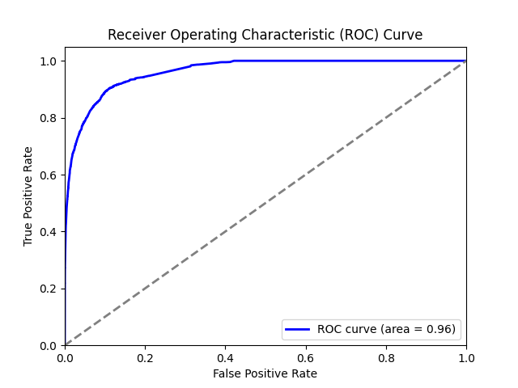
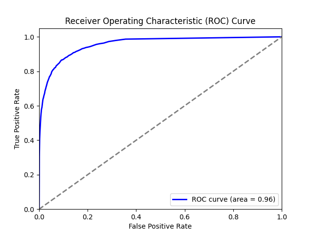
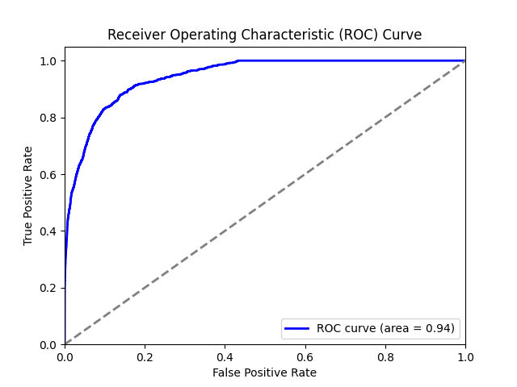
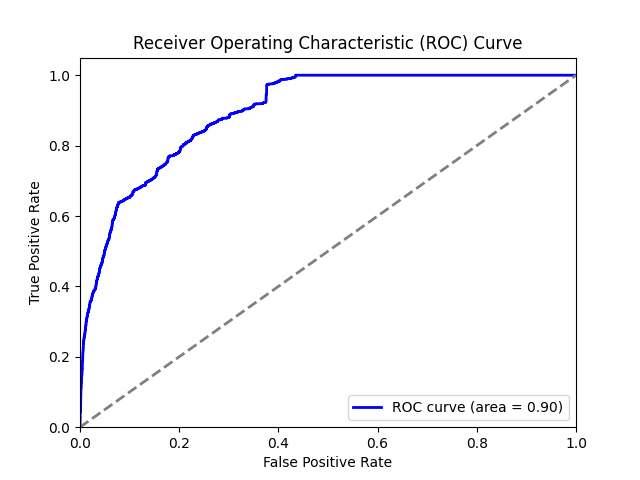
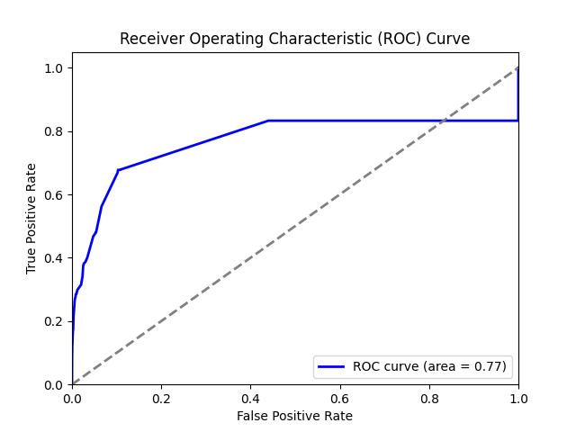

# use uncleaned_balanced_train_dataset as train set

## logistic regression

Confusion Matrix:
[[1185248   85633]
 [    621    1022]]
Classification Report:
              precision    recall  f1-score   support

           0       1.00      0.93      0.96   1270881
           1       0.01      0.62      0.02      1643
    
    accuracy                           0.93   1272524

   macro avg       0.51      0.78      0.49   1272524
weighted avg       1.00      0.93      0.96   1272524

ROC AUC Score:
0.9163596546446227

## SVM

Confusion Matrix:
[[1170243  100638]
 [    415    1228]]
Classification Report:
              precision    recall  f1-score   support

           0       1.00      0.92      0.96   1270881
           1       0.01      0.75      0.02      1643
    
    accuracy                           0.92   1272524

   macro avg       0.51      0.83      0.49   1272524
weighted avg       1.00      0.92      0.96   1272524

ROC AUC Score:
0.9298886955019715

## GBM

Confusion Matrix:
[[1214054   56827]
 [    370    1273]]
Classification Report:
              precision    recall  f1-score   support

           0       1.00      0.96      0.98   1270881
           1       0.02      0.77      0.04      1643
    
    accuracy                           0.96   1272524

   macro avg       0.51      0.87      0.51   1272524
weighted avg       1.00      0.96      0.98   1272524

ROC AUC Score:
0.9623112267546706

## random forest

Feature Importances:
step: 0.3735936351911529
amount: 0.3997912926779713
type_CASH_IN: 0.03425585075394292
type_CASH_OUT: 0.02892721968335169
type_DEBIT: 0.0007035143488017113
type_PAYMENT: 0.0404408245289127
type_TRANSFER: 0.12228766281586692
Confusion Matrix:
[[1209799   61082]
 [    359    1284]]
Classification Report:
              precision    recall  f1-score   support

           0       1.00      0.95      0.98   1270881
           1       0.02      0.78      0.04      1643
    
    accuracy                           0.95   1272524

   macro avg       0.51      0.87      0.51   1272524
weighted avg       1.00      0.95      0.97   1272524

ROC AUC Score:
0.956185550807463

## ANN

Confusion Matrix:
[[1262793    8088]
 [    982     661]]
Classification Report:
              precision    recall  f1-score   support

           0       1.00      0.99      1.00   1270881
           1       0.08      0.40      0.13      1643
    
    accuracy                           0.99   1272524

   macro avg       0.54      0.70      0.56   1272524
weighted avg       1.00      0.99      1.00   1272524

ROC AUC Score:
0.9449562059781665

# use uncleaned_imbalanced_train_dataset as train set to compare

## logistic regression

Confusion Matrix:
[[1270862      19]
 [   1643       0]]
Classification Report:
              precision    recall  f1-score   support

           0       1.00      1.00      1.00   1270881
           1       0.00      0.00      0.00      1643
    
    accuracy                           1.00   1272524
   macro avg       0.50      0.50      0.50   1272524
weighted avg       1.00      1.00      1.00   1272524

ROC AUC Score:
0.8957910571085557

## GBM

Confusion Matrix:
[[1270870      11]
 [   1590      53]]
Classification Report:
              precision    recall  f1-score   support

           0       1.00      1.00      1.00   1270881
           1       0.83      0.03      0.06      1643
    
    accuracy                           1.00   1272524
   macro avg       0.91      0.52      0.53   1272524
weighted avg       1.00      1.00      1.00   1272524

ROC AUC Score:
0.7688617270217172

##### About hypermeters, I tried grid search but it didn't make so much difference.

##### Test set follows actual distribution, so test set is an imbalance dataset with a great portion of non-fraud cases. As a result, the precision is quite low, so in this case, we only focus on accuracy and recall.

##### Also, I used imbalanced training set to train logistic regression model and GBM model to make comparisons. For logistic regression, the model cannot detect fraud cases. And for GBM, the model has high precision and low recall, which is also not suitable for fraud detection.
